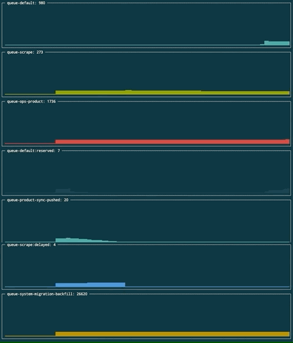

[](https://travis-ci.org/danieloliveira079/laravel-queues-exporter)

# [Alpha Version] Laravel Queues Metrics Exporter

The exporter is an application that extracts metrics from Laravel queues when the PHP application uses the `Redis` driver and forwards those metrics to different subscribed consumers.

It runs externally to the PHP application itself and it only requires the Redis connection information.

Available consumers are:
* StatsD
* Stdout (raw)
* Log (stdout formatted)
* More to come...

## Motivation

Usually Laravel applications take a different path when it comes down to queues metrics exposure. Most of the times, this is handled by the queueing service provider like AWS SQS via Cloud Watch.

Unfortunately, this is not so easy when the Laravel queue driver is set to `Redis`. This service does not provide a monitoring tool that would work out of the box. It turns out that the development team must implement some sort of mechanism tha can expose those metrics. Either via an API endpoint or application logs.  

Alternatively, projects like https://horizon.laravel.com/ can be plugged into the Laravel application and be consumed via the UI/Dashboards, consequently adding extra dependencies to the project.

This approach does not fit well when a team wants to aggregate metrics using an external service or tool like Prometheus, Datadog or StatsD.

The Laravel Queues Metrics Exporter implements different kinds of consumers and the list can be extended.

## Architecture

The laravel metrics exporter application is composed by different components:
* Exporter: Starts and manages the `Scan` process using provided configuration
* Connector: Responsible by establish and hold the connection with the Redis server. Including the forwarding of commands triggered by the dispatcher.   
* CommandDispatcher: Dispatch commands using the connector and reply back to sender
* Extractor: Used by the exporter to retrieve information from Redis throughout the connector 

## How it works

There is only one requirement that must be fulfilled before running the exporter. The address and port of the remote Redis server.

The exporter will start a `scanning` process that extracts Laravel queues information in terms of the number of current jobs present on each available queue.
 
The results are then publish to all consumers that have initialised via application flag `export-to`.

Some of the possible outputs are:

```bash
# Stdout (raw)
queue-high-priority 100
queue-low-priority 200
```

```bash
# Log (formatted)
2019/08/16 12:55:32 queue-high-priority 100
2019/08/16 12:55:34 queue-low-priority 200
```

```bash
# StatsD - From server's log (DEBUG)
exporter.queue-high-priority:100.000000|g
exporter.queue-low-priority:200.000000|g
```

## Running the exporter 

The instructions below applies to cases where you want to run the exporter on a environment that is not provisionied by the `docker-compose`.
You must inform the names or addresses from the redis and statsd server. Otherwise the exporter will not boot up.
```bash
# Run the exporter using latest docker image
docker run -it --rm --name laravel-queues-exporter --network=host \
    danieloliv/laravel-queues-exporter --redis-host=${REDIS_HOST} --redis-port=${REDIS_PORT} \
    --collect-interval=2 --statsd-host=${STATSD_HOST} --statsd-port=${STATSD_PORT}
```

## Using the exportercli

You can run the exportercli running the following command:

Start all services by running:
```bash
make up
```
From another terminal session start the exportercli:

```bash
go run cmd/cli/main.go watch
```

The output will be a list of all queues that currently have jobs. The dashboard will be actively updated.



## Development

* Docker
* Docker Compose
* Go >= 1.12

```bash
# Build and run the exporter and services. Code changes will not be reloaded 
make up
```

```bash
# Start services only. Useful when running the application outside of the docker context
make services 
```

## Tests

```bash
make test
```

## Roadmap

- Prometheus Scrapping
- HTTP Post
- GRPC
- DB
